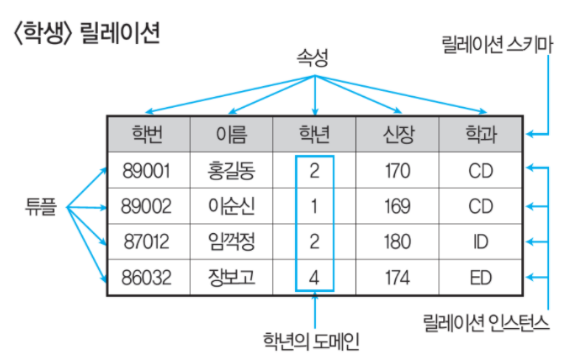
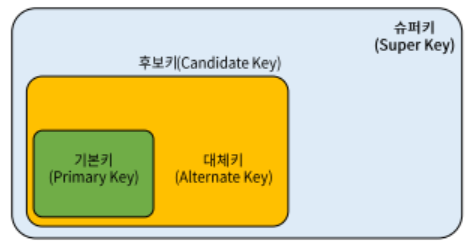

## 정규형(완전 중요)
목적 : 이상현상(삽입, 삭제, 갱신)을 제거하기 위해서

**도부이결다조**
1정규형 : 도메인이 원자값
2정규형 : 부분함수적 종속제거
3정규형 : 이행적 함수 종속제거
BCNF : 결정자이면서 후보키가 아닌것 
4정규형 : 다치종속제거
5정규형 : 조인종속성 이용

## 반정규화
목적 : 성능현상을 위해서 정규화에 반하는 것을 하는 것

## 데이터베이스 설계
- 요구사항 분석
- 개념적 설계 : ERD작성
- 논리적 설계 : 정규화 수행 / 트랜잭션, 인터페이스 설계
- 물리적 설계 : 성능 고려를 해야한다.

## 트랜잭션 특성
1) 원자성 (Atomicity) : 모두 반영되거나, 모두 반영되지 않는것
2) 일관성 (Consistency) : 일관적으로 데이터 유지(=트랜잭션 전후의 상태가 같아야함)
3) 격리성(=독립성) (Isolation) : 하나의 트랜잭션이 수행중에, 다른 트랜잭션이 영향을 미쳐서는 안된다.
4) 영속성(Durability) : 트랜잭션 결과는 영구적으로 반영되어야한다.

## 분산 데이터베이스 시스템
1) 물리적으로 분산된 데이터베이스 시스템을 논리적으로 하나의 데이터베이스 시스템처럼 사용할 수 있도록 한것이다.
2) **물리적으로 분산되어 지역별로 필요한 데이터를 처리할 수 있는 지역컴퓨터를 분산처리기**라고 한다.
3) 분산 데이터베이스 시스템을 위한 통신 네트워크 구조가 데이터통신에 영향을 주므로 효율적으로 설계해야한다.
4) 데이터베이스가 분산되어있음을 사용자가 인식할 수 없도록 하는 분산 투명성을 이루어야한다.

## 분산 데이터베이스 구성요소
- 분산처리기
  - 자체적으로 처리 능력을 가지며, 지리적으로 분산되어있는 컴퓨터시스템
- 분산 데이터베이스
  - 지리적으로 분산되어있는 데이터베이스로서 해당 지역의 특성에 맞게 데이터베이스가 구성
- 통신 네트워크
  - 분산처리기들을 통신망으로 연결하여 논리적으로 하나의 시스템처럼 작동할 수 있도록 하는 통신 네트워크

## 데이터베이스 인덱스
- 문헌의 색인, 사전과 같이 데이터를 쉽고 빠르게 찾을 수 있도록 만든 데이터 구조
- 테이블에 붙여진 색인으로 데이터 검색 시 처리속도도 향상에 도움이 된다.
- **인덱스의 추가, 삭제 명령어는 각각 CREATE, DROP**이다.
- **대부분의 데이터베이스에서 테이블을 삭제하면 인덱스도 같이 삭제된다.**

## 데이터베이스 언어
- 정의어(DDL) : CREATE, DROP, ALTER (**참고, VIEW는 ALTER명령어 없음!**)
- 조작어(DML) : SELECT, INSERT, UPDATE, DELETE
- 제어어(DCL) : COMMIT, ROLLBACK, GRANT, REVOKE

## 물리적 데이터베이스의 구조의 기본데이터 단위인 저장 레코드의 양식을 설계할 때 고려해야할 사항
1) 데이터타입
2) 데이터 값의 분포
3) 접근 빈도

**트랜잭션 모델링은 해당 사항이 아님!**

## 데이터 사전(=시스템 카탈로그, 시스템 데이터베이스
1) 시스템 카탈로그는 사용자와 데이터베이스 관리 시스템의 접근이 가능하다.
    - 단, 사용자는 삽입, 삭제, 갱신 등 불가능!
    - 시스템 카탈로그는 사용자와 시스템 모두 접근할 수 있지만, 
    - 데이터 디렉토리는 시스템만 접근이 가능!
2) 데이터베이스에 대한 데이터인 메타데이터를 저장하고 있다. (=시스템 카탈로그에 저장된 내용을 메타데이터라고 함.)
3) 데이터 사전에 있는 데이터에 실제로 접근하는데 필요한 위치정보는 데이터 디렉토리라는 곳에서 관리한다.
4) 데이터베이스에 저장된 모든 개체들에 대한 정의나 명세에 대한 정보가 수록되어있는 시스템 테이블

## 릴레이션(테이블)

- 튜플(행), 속성(열)
- 모든 튜플은 서로 다른 값을 가지고 있다.
- 하나의 릴레이션에서 튜플은 특정한 순서를 가지고 있다. (X)
- 각 속성은 릴레이션 내에서의 유일한 이름을 가진다.
- 모든 속성은 원자값을 가진다.

## 뷰(View)
- 뷰는 다른 뷰를 기반으로 새로운 뷰를 만들 수 있다.
- **뷰는 일종의 가상 테이블이며, update에는 제약이 따른다.** **(ALTER안됨!)**
- 뷰는 기본 테이블을 만드는 것처럼 create view를 사용하여 만들 수 있다.
- 물리적으로 존재하는 기본테이블을 통해 뷰를 만들게 된다.

## 스키마 3단계 구조
- 외부스키마 : 사용자 관점의 스키마(=사용자 뷰)
- 개념스키마 : 기관/조직체 관점의 스키마(=전체 뷰, 제약조건 등)
- 내부스키마 : 시스템 프로그래머/설계자 관점의 스키마(=저장장치)

## Partially Committed
- 트랜잭션의 상태 중 트랜잭션의 마지막 연산이 실행된 직후의 상태로, 
- **모든 연산의 처리는 끝났지만, 트랜잭션이 수행한 최종 결과를 데이터베이스에 반영하지 않은 상태**

## 키의 종류
- 슈퍼키 : 유일성만 만족하면 됨
- 후보키 : 유일성 + 최소성
- 기본키 : 유일성 + 최소성 / 중복X, NOT NULL
- 대체키 : 유일성 + 최소성

## 무결성 종류
- 개체 무결성 : NULL X, 중복 X
- 참조 무결성 : 참조되는 값이 없어서는 안된다.
  - 자식 릴레이션의 외래키는 부모 릴레이션의 기본키와 도메인이 동일해야한다.
  - 자식 릴레이션의 값이 변경될 때, 부모 릴레이션의 제약을 받는다.
- 도메인 무결성 : 허용되는 범위의 값만 가지는 것(학년에는 8학년이 없는것과 같은 이치!)
- 속성 무결성
- 키 무결성
- 사용자 정의 무결성

## Operation
- 데이터 모델의 구성 요소 중 데이터 구조에 따라 개념세계나 컴퓨터 세계에서 실제로 표현된 값을 처리하는것

## Degree, Cardinality
- Degree : 속성의 수
- Cardinality : 튜플의 수

## GRANT명령어
- 사용자 'PARK'에게 테이블을 생성할 수 있는 권한
- grant create table **to** park;

