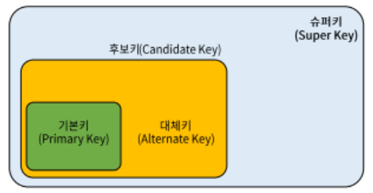

## 데이터베이스 설계 순서
1) 요구 조건 분석 : 요구사항 명세서 작성
2) 개념적 설계 : ERD 
3) 논리적 설계 : 트랜잭션, 인터페이스 설계, 정규화
4) 물리적 설계 : 성능 고려, 물리적 구조의 데이터 변환
5) 구현 : DDL로 데이터베이스 생성

DDL - Create, drop, alter
DML - insert, update, delete
DCL - rollback, commit, grant, revoke(권한을 뺏는것)

**조인종속성 - 5정규형**

## 데이터베이스 구축 (도,부,이,결,다,조)
- 제1정규형 : 도메인이 원자값
- 제2정규형 : 부분함수적 종속제거
- 제3정규형 : 이행적 함수 종속 제거
- BCNF : 결정자이면서 후보키가 아닌것 제거
- 제4정규형 : 다치 종속 제거
- 제5정규형 : 조인종속성 이용

## 키의 종류
- 슈퍼키 : 유일성만 만족하면됨. 
- 후보키 : 유일성 + 최소성
- 기본키 : 유일성 + 최소성
- 대체키 : 유일성 + 최소성

## 관계 해석 기호

## 튜플, 속성, cardinality, degree
- cardinality : 튜플의 수
- degree : 속성의 수

## 집합연산자
union - 합집합
union all - 중복을 허용하는 합집합
minus - 차집합
intersect - 교집합

## 분산 데이터베이스 시스템
- 분산데이터베이스는 논리적으로는 하나의 시스템에 속하지만 물리적으로는 여러개의 컴퓨터 사이트에 분산되어있다.
- 분산데이터베이스 시스템의 주요 구성 요소 - 분산데이터베이스, 분산처리기, 통신네트워크, 투명성

## CASCADE, RESTRICTED
CASCADE - 영속성
RESTRICTED - 삭제할때 잘못 삭제하면 오류를 발생시켜라

## 병행제어(비유 : 화장실, 여러명 사용자)