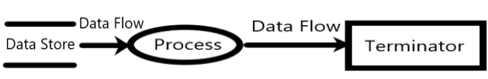

## SDLC(Software Development Life Cyle, 소프트웨어 개발 생명주기)
- 폭포수 방법론
- 계획 > 분석 > 설계 > 구현 > 테스트 > 유지/운영
  - 유지/운영 단계에서 비용이 가장 많이 든다.

## 요구사항 검증방법
- 동료검토(=개발자 검토) 
  - 2 ~ 3명이 진행하는 리뷰형태로, **작성자가 명세서를 설명하고 이해관계자(동료)들이 들으면서 결함을 발견하는 형태**
- 워크스루
  - 검토자료(=요구사항명세서)를 **회의전에 배포하여 사전 검토한후,**
  - **짧은 시간동안 회의를 진행하는 형태**로, **오류를 조기에 검출**하는데 목적을 둔 검증기법
- 인스펙션
  - **명세서 작성자를 제외한** 다른 검토 전문가들이 확인하면서 결함을 발견하는 형태

## 코드 설계(완전 중요)
- 데이터를 효율적이고 정확하게 처리하게 위해 부여하는 기호나 숫자체계
- 코드 설계의 목적은 데이터의 저장공간을 절약하고, 오류를 줄이고, 데이터의 검색과 정렬을 용이하게 하는 것이다.

- 코드설계의 원칙
  - 간결성 - 코드는 가능한 짧고 간단하게 부여해야한다.
  - 일관성 - 코드는 동일한 규칙과 방식으로 부여해야한다.
  - 유연성 - 코드는 변화에 적응할 수 있도록 여유를 두어야한다.
  - 명확성 - 코드는 의미가 분명하고 혼동되지 않도록 해야한다.
- **코드 설계 방법** 
  - **순차 코드** - 코드에 일련번호를 부여하는 방법, ex) 주민번호, 학생번호
  - **구분 순차 코드** - 몇 개의 블록으로 나누어 각 블록에 의미를 부여
  - **십진 분류 코드** - 10진으로 분류하고, 다시 10진으로 분류
  - **그룹 분류 코드** - 코드화 대상항목을 일정 기준에 따라, 대-중,소 분류 등으로 구분하고, 각 그룹안에서 일련 번호를 부여
    - ex) 1-01-001: 본사-총무부-인사계
  - **연상 코드** - 코드에 의미를 부여하는 방법, ex) TV-2002 (2002년도에 만들어진 TV)
  - **블록 코드** - 코드를 여러 부분으로 나누어 각 부분에 의미를 부여하는 방법으로, 대상항목 중 공통성이 있는 것끼리 블록으로 구분, 각 블록 내에서 일련번호를 부여하는 방법
    - ex) 1001 ~ 1100 : 총무부, 1101 ~ 1200 : 영업부
  - **표의 숫자 코드** - 대상 항목의 성질, 길이, 넓이, 부피, 지름, 높이 등 물리적 수치를 그대로 코드에 적용시키는 방법으로, 유효 숫자 코드라고도 한다.
    - ex) 120-720-1500: 두께*폭*길이가 120*720*1500
  - **합성 코드** - 필요한 기능을 하나의 코드로 수행하기 어려운 경우, 2개 이상의 코드를 조합하여 만드는 방법
    - ex) 연상코드 + 숫자코드
  - **10진 코드** - 코드화 대상항목을 0~9까지 10진분할
    - ex) 1000:공학, 1100: 소프트웨어공학, 1110: 소프트웨어설계

## 객체지향프로그램 VS 절차지향프로그램
- 절차지향프로그램 : 하향식
- 객체지향프로그램
  - 데이터를 추상화하는 단위 : 클래스

## 데이터 흐름도- DFD(Data Flow Diagram) (완전 중요, 그림까지 기억해야함)
- 데이터 흐름도(DFD)는 시스템 구성요소인 프로세스와 프로세스간 데이터 흐름을 표현하는 주요 도구
- 자료 흐름 그래프 또는 버블차트라고 부르기도 한다.
- 데이터 흐름도(DFD)의 구성요소
  - 프로세스(Process) - 자료의 처리/변환 과정을 표현한다. - O
  - 데이터 흐름도(Data Flow) - 자료의 흐름을 표현한다. - -
  - 자료저장소(Data Store) - 파일, DB 등 저장소의 위치를 표현한다. - ->
  - 단말(Terminator) - 자료의 출처와 도착지를 표현한다. - ◻️

