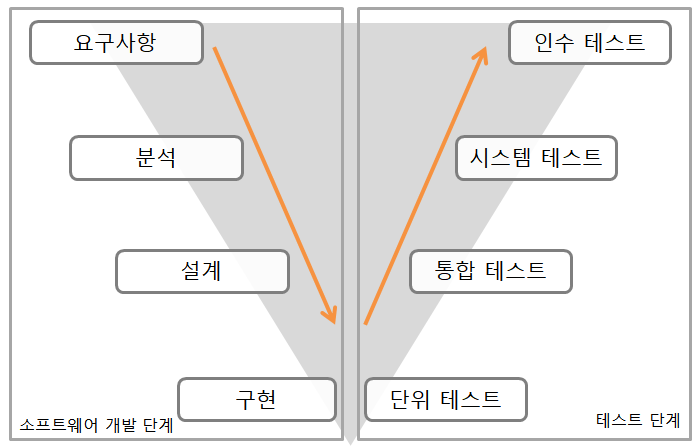

## 개발 단계에 따른 애플리케이션 테스트
- 테스트 단계 : 단위테스트 > 통합테스트 > 시스템테스트 > 인수테스트
- 소프트웨어 개발단계 : 요구사항 > 분석 > 설계 > 구현

- 단위테스트에서는 개발자가 진행하는 것으로, 정적테스트와 동적테스트로 나눌 수 있다.
- 정적테스트는 소스코드를 보는 것이고, 동적테스트는 입력값을 넣고 출력값을 확인하는 것

- 시스템테스트에서는 기능적 요구사항과 비기능적 요구사항 각각을 만족하는지 테스트

- 인수테스트
  - 알파테스트 : 개발자 앞에서 사용자가 테스트
  - 베파테스트 : 개발자 없이 사용자만 테스트

- 통합테스트
  - 시스템을 구성하는 모듈의 인터페이스와 결합을 테스트하는 것
  - 하향식 통합테스트
    - 프로그램의 상위에서 하위모듈 방향으로 통합하면서 테스트
    - 깊이 우선, 넓이 우선
    - Stub 사용  
  - 상향식 통합테스트
    - 프로그램의 하위에서 상위모듈 방향으로 통합하면서 테스트
    - 드라이버 사용

## 소프트웨어 개발 생명주기(SDLC)모델
- 계획 > 분석 > 설계 > 구현 > 테스트 > 유지
- 유지단계가 비용이 제일 많이 듦.
- 폭포수 방법론

## 분석과 설계단계에서 진행되는 요구사항분석 프로세스
- 요구사항분석 프로세스 순서(중요)
  - 도출
  - 분석
  - 명세서
  - 확인
  - **도, 분, 명, 확**

## 요구사항 검증방법(소스코드 품질분석)
- 동료검토(=개발자 검토)
  - 2 ~ 3명이 진행하는 리뷰형태로, **작성자가 명세서를 설명하고 이해관계자(동료)들이 들으면서 결함을 발견하는 형태**
- 워크스루
  - 검토자료(=요구사항명세서)를 **회의전에 배포하여 사전 검토한후,**
  - **짧은 시간동안 회의를 진행하는 형태**로, **오류를 조기에 검출**하는데 목적을 둔 검증기법
- 인스펙션
  - 공식적 검사회의 
  - **명세서 작성자를 제외한** 다른 검토 전문가들이 확인하면서 결함을 발견하는 형태

동료검토 < 워크스루 < 인스펙션으로 동툐검토가 가장 작은 단위이다.
- 동료검토, 워크스루, 인스펙션으로 리팩토링과정을 거친다.

## 형상관리(완전 중요)
- 소프트웨어의 개발과정에서 소프퉤어이 **변경사항을 관리하기 위해 개발된 일련의 활동**
- 소프트웨어 개발과정에서 발생하는 모든 변경을 관리하는 활동
- 형상관리 도구
  - CVS, SVN, GIT

- **형상관리 절차(식, 통, 감, 기)**
  - 형상식별 > 형상통제 > 형상감사 > 형상기록

- 형상관리 용어정리
  - import : 맨 처음 프로젝트 시작시 저장소에 등록
  - check-out : 저장소에서 소스를 받아오는 명령
  - add : 새 파일을 만들었을 경우 관리 파일로 추가
  - commit : check-in과 동일, 수정한 파일을 저장소에 저장하여 갱신
  - update : 저장소에 변경된 내용을 로컬로 반영
  - diff : 소스를 비교하는 명령
  - merging : 충돌난 파일에 대해 합치는 작업

## 테스트케이스
- 테스트의 목표 및 테스트 방법을 결정한 후, 테스트케이스를 작성해야한다.
- 프로그램에 결함이 있더라도 입력에 대해 정상적인 결과를 낼 수 있기때문에 검사할 수 있는 테스트케이스를 찾는 것이 중요하다.
- 개발된 서비스가 정의된 요구사항을 준수하는지 확인하기 위한 **입력값과 실행조건, 예상결과**의 집합으로 볼 수 있다.
- 테스트 케이스 실행이 통과되었는지 실패하였는지 판단하기 위한 기준을 테스트 오라클이라고 한다.
  - 참오라클
  - 샘플링오라클
  - 추정오라클(=휴리스틱오라클)
  - 일관성오라클

## 테스트 하네스 도구
- 테스트 드라이브
- 테스트 스텁
- 테스트 슈트
- 테스트 케이스
- 테스트 스크립트
- 목 오브젝트

## JAVA 접근지정자 중 protected
- 상속관계 혹은 같은 패키지 

## DRM(Digital Rights Management)
- 저작권자가 배포한 디지털 콘텐츠가 저작권자의 의도한 용도로만 사용되도록 디지털 콘텐츠의 생성, 유통, 이용까지의 전 과정에 걸쳐 사용되는 디지털 콘텐츠 관리 및 보호 기술이다.

- 예시로 멜론 사이트에서 음악 스트리밍을 할 때 음악 MP3 파일을 DRM 다운로드하는 게 있었는데 여기서 DRM이 인가된 사용자에게만 파일을 사용할 수 있도록 하는 저작권 관리 시스템이다. DRM 다운로드 한 MP3 파일은 해당 기기, 해당 사용자에 한해서 사용이 가능하고 타인에게 공유가 불가능하거나 공유 시 사용자 인증이 제대로 안 되는 것을 감지해 MP3 파일이 정상 작동하지 않는다.

- DRM 기술요소
  - 암호화 : 콘텐츠 및 라이선스 암호화
  - 키관리 : 콘텐츠를 암호화한 키에 대한 저장 및 배포 기술
  - 식별기술 : 콘텐츠에 대한 식별체계 표현기술
  - 저작권 표현 : 라이선스의 내용 표현 기술
  - 정책 관리 : 라이선스 발급 및 사용에 대한 정책 표현
  - 크랙 방지 : 크랙에 의한 콘텐츠 사용방지 기술
  - 인증 : 라이선스 발급 및 사용의 기준이 되는 인증기술
  - 인터페이스 : 상이한 DRM플랫폼 간의 상호 호환성 인터페이스
  - 사용권한 : 콘텐츠의 사용에 대한 권한을 관리하는 기술 요소

## RCS(Revision Control System)
- 동시에 소스를 수정하는 것을 방지하며 
- 다른 방향으로 진행된 개발 결과를 합치거나 
- 변경 내용을 추적할 수 있는 소프트웨어 버전 관리 도구

