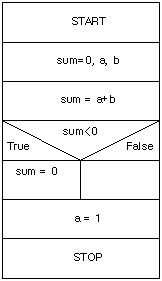

## Alien Code
- 아주 오래되거나 참고문서 또는 개발자가 없어 유지보수 작업이 아주 어려운 프로그램

## 인터페이스 간의 통신을 위해 이용되는 데이터 포멧
- JSON : javascript객체 문법, 구조화된 데이터를 표현
- XML : 웹에서 구조화한 문서를 표현하고 설계한 **마크업언어**
- YAML : 사람이 쉽게 읽을 수 있는 **데이터 직렬화 양식**
- CSV : 몇가지 필드를 **쉼표**(,)로 구분한 텍스트 데이터

## NS Chart
- 논리의 기술에 중점을 두고 도형을 이용한 표현 방법
- 이해하기 쉽고 코드 변환이 용이하다.
- 연속, 선택, 반복 등의 제어 논리 구조를 표현한다.

- **화살표나 GOTO를 사용하지 않음!**

## 퀵정렬(keyword : pivot)
- 분할정복에 기반한 알고리즘으로 피벗을 사용하며 최악의 경우 n(n-1)/2회의 비교를 수행해야하는 정렬

n^2 
- 선택, 삽입, 버블

n*log2n 
- 퀵, 힙, 병합

## 화이트 박스 테스트
- 소스코드 내부를 보는 것
- 프로그램의 내부구조, 동작을 디테일하게 검사
- **개발자관점의 테스트 방법**
  - 문자검증
  - 선택검증
  - 경로검증
  - 조건검증

## 블랙 박스 테스트
- 소프트웨어 내부구조나 **동작원리를 모르는 상태에서** 동작을 검사
- 내가 원하는 기능이 예측한 대로 정상 동작하는 지를 확인
- **사용자 관점의 테스트 방법**
  - 동등 분할 기법
  - 경계값 분석 기법
  - 오류 예측 기법
  - 원인 결과 그래프 기법
  - 의사결정 테이블 테스팅
  - 상태 전이 테스팅

## 인스펙션
- **공식적 검사회의**
- **작업자 외 다른 전문가가 검사하는 공식적인 리뷰 기법**
- **프로그램을 수행시켜보는 것 대신에 읽어보고 눈으로 확인하는 방법**으로 볼 수 있다.
- 코드 품질 향상 기법 중 하나이다.
- 동적 테스트 시에만 활용하는 기법(X) -> 눈으로 확인하기 때문에 아님!
- 결함과 함께 코딩 표준 준수 여부, 효율성 등의 다른 품질 이슈를 검사하기도 한다.

## Risk Analysis
- 프로젝트에 내재된 위험 요소를 인식하고 그 영향을 분석하여 이를 관리하는 활동으로서,
- 프로젝트를 성공시키기 위하여 위험 요소를 사전에 예측, 대비하는 모든 기술과 활동을 포함하는 것
